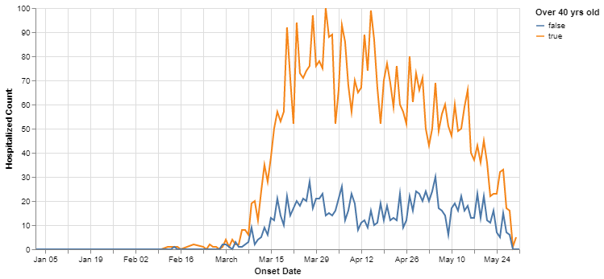
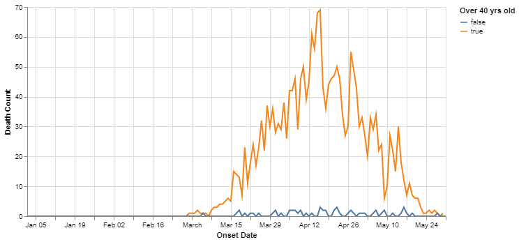

                                **Covid-19 Research for Ohio**

*First published: May 17, 2020*
*Added Ohio plots: May 31, 2020*

# Summary
I am trying to put together some notes and resources regarding the potential risks of covid-19. As the United States begins to roll back stay-at-home orders and business closures, I would like to have a data-driven understanding of what the realistic risks are to my family. The primary questions I am trying to answer are:

1. What are the chances of illness/death from covid-19 relative to baseline levels of risk from other related causes, such as flu, pneumonia, or other maladies?
2. If someone in my family is exposed to covid-19, what are the chances that they will be infected? Suffer symptoms? 

## Useful resources I have found:
1. [Ohio Covid-19 Dashboard](https://coronavirus.ohio.gov/wps/portal/gov/covid-19/dashboards/overview). Ohio published better data than most states, and luckily includes age information. Raw data for their dashboard can be downloaded from here in CSV form.
2. [Yearly Mortality rates from Flu, Pneumonia, and related illnesses](https://gis.cdc.gov/grasp/fluview/mortality.html). 
    - I included in the title of this link "and related illnesses." The CDC estimates flu and pneumonia deaths based on automated analysis of death certificates, meaning that if a death certificate did NOT directly state pneumonia or flu as the cause of death, but conditions were consistent with one of these, they include it. Thus, the numbers presented here are estimates, and on the high end.
3. [New York City deaths from covid](https://www1.nyc.gov/assets/doh/downloads/pdf/imm/covid-19-daily-data-summary-deaths-05132020-1.pdf)
4. [Covid antiobodies present in 21% of new yorkers](https://www.nytimes.com/2020/04/23/nyregion/coronavirus-new-york-update.html)
5. [Ohio demographic statistics](https://www.infoplease.com/us/comprehensive-census-data-state/demographic-statistics-48)
6. [New York Demographics](https://newyork.areaconnect.com/statistics.htm)
    - these data are from 2000, but still useful for order-of-magnitude calculations
7. [I can only trust myself at this point.](https://vicki.substack.com/p/congrats-youre-the-ceo-now) Nice article on how we need to make decisions based on imperfect data right now.

## 1. What is the risk from covid relative to other illnesses?
I have found this question to be very hard to answer, as have many other individuals, researchers, and politicians. Due to how society has shifted over the past few months, I do not think it is possible or worthwhile to try and perform an apples-to-apples comparison of the risks present to the average American due to covid vs influenza or pneumonia. Ideally, I would have liked to be able to answer the question "If I leave the house today, what risk am I undertaking?" This question is not worth trying to answer right now.

On average, the CDC states that about ~150,000 people in the US per year die from influenza, pneumonia, and related illnesses. While this is greater than the current fatality levels from covid, I cannot answer how the stay-at-home orders have affected the potential covid death rates. Would they be much higher if we were not doing anything? This is why I have given up on this analysis and have moved on to my second question.

## 2. Assuming I or a family member gets covid-19, what might I expect to happen? How likely am I to be hospitalized?
I think this is a much better question because it assumes the worst. If you decide that you plan to stop self-isolating and start interacting with other people, you should assume that, at some point, you will contract covid-19. So, what happens if you DO contract covid-19?

I plan to make lots of assumptions in this exercise, all of which can be reasonably contested. However, these are the data I have right now, and I need to make decisions regarding interacting with others, and these are the data I have. So, here we go.

New York City estimates that about 20% of its population has virus antibodies. This is based on testing and sampling they have done around the city. We also know, reasonably well, the total population of NYC and their age demographics, as well as total numbers of NYC residents, as a function of age, who have been hospitalized and/or died from covid-19. See sources 3, 4, and 6 above for these numbers. I understand that all of these can be contested, but they pass the "smell" test to me, and with this data I can reasonably start to calculate risk factors related to covid-19.

1. 20% of NYC's ~8 million population is about 1.6 million. So, I assume that 1.6 million New Yorkers have contracted covid-19.
2. Assuming that this 20% infection rate is evenly distributed (meaning 20% of toddlers and 20% of seniors HAVE been infected, regardless of whether or not they show symptoms), we can produce the following data:

|Age Group	|Total Covid Infections (estimate)	|Confirmed Cases	|Hospitalizations	|Deaths	|Rate of confirmation in this group	|Rate of hospitalization	|Rate of Deaths|
|---|---|---|---|---|---|---|---|
|0-17 years	|430690	|6090	|514	|9	|1.41%	|0.12%	|0.0021%|
|18-44 years	|644226	|66080	|7199	|593	|10.26%	|1.12%	|0.09%|
|45-64 years	|339168	|56838	|14017	|2908	|16.76%	|4.13%	|0.86%|
|65-74 years	|98959	|16662	|7915	|2775	|16.84%	|8.00%	|2.80%|
|75 and older years	|88613	|17943	|11213	|6219	|20.25%	|12.65%	|7.02%|

3. The rightmost three columns in this table are the most noteworthy. They essentially say "If someone contracts covid-19, what are the chances that they will show symptoms (first column), be hospitalized (second column), or pass away (final column). 

4. However, an important adjustment to this table is accounting for pre-existing conditions. NYC also keeps track of how many of each case is complicated by pre-existing conditions. Using this, we can add an adjustment which accounts for risk from pre-existing conditions.

|Age Group	|Absence of pre-existing conditions in confirmed cases	|Rate of symptoms without pre-existing conditions|	Rate of hospitalization without pre-existing conditions	|Rate of Deaths without pre-existing conditions|
|---|---|---|---|---|
|0-17 years	|33.33%	|0.47%	|0.04%	|0.001%|
|18-44 years	|2.83%	|0.29%	|0.03%|	0.003%|
|45-64 years	|2.11%|	0.35%	|0.09%|	0.018%|
|65-74 years	|0.13%	|0.02%	|0.01%	|0.004%|
|75 and older years	|0.03%	|0.01%	|0.00%	|0.002%|

Some notes on the above table:
- The rate of absence of pre-existing conditions in confirmed cases is based on deaths with pre-existing conditions. I cannot find age-based data for all cases, which supposedly is around 5%, so I went with the more conservative values seen here. 
    - As a result of this, the absence rate for the youngest age bracket is probably high, due to how small a sample is available for deaths (6 of 9 deaths in NYC had pre-existing conditions)
- Overall, hospitalization rates are fairly low, with a 3 in 10,000 chance of being hospitalized for 18-44 year olds

I am still working on this analysis, so I do not plan to make any conclusions yet. I think a good companion piece to the second data table would be a comparison of available numbers for the flu and pneumonia. That is, if we ASSUME you definitely have the flu, what are the chances you will be hospitalized? Asymptomatic?

## Updates: Some visuals

By getting raw data from the Ohio Covid dashboard, I made some quick plots of age-related covid data for the entire state. Unfortunately, Ohio does not publish rates of pre-existing conditions for covid patients - I am still searching for these.

Some important notes for these data:
1. Ohio's population is about 11 million
2. About 60% of the population is under the age of 40 - median age is 36.

Hospitalizations and deaths trend heavily towards older Ohioans. Case count is actually close for both, but it is difficult to case count as a metric, since it is largely driven by more testing being available.